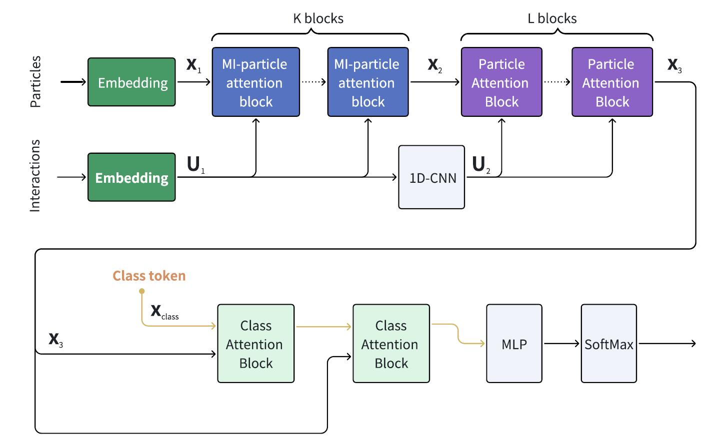
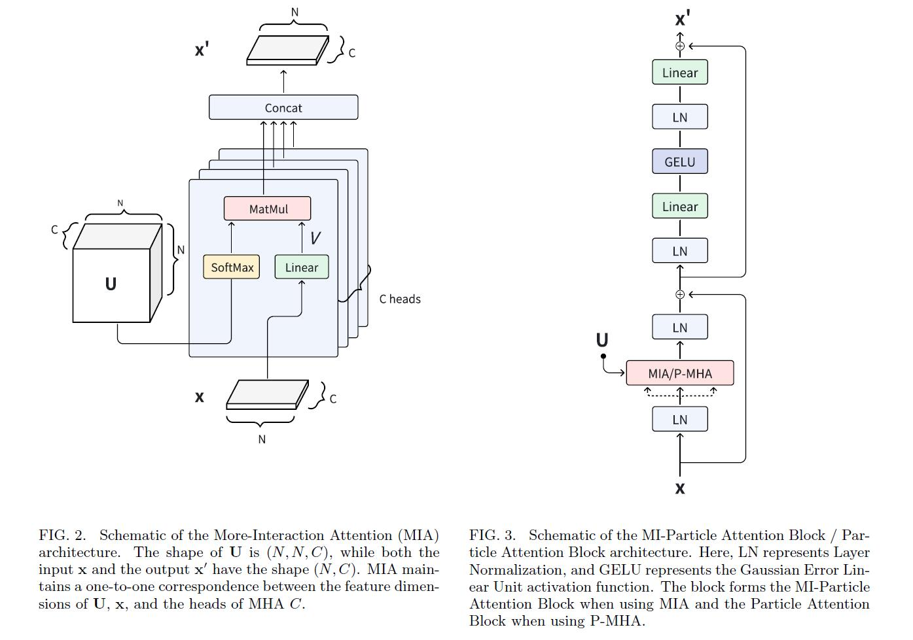

# More-Interaction Particle Transformer
This repo is the official implementation of "[Jet Tagging with More-Interaction Particle Transformer](https://arxiv.org/abs/2407.08682)". It includes the code and pre-trained models.

arXiv:2407.08682

## Introduction

### More-Interaction Particle Transformer (MIParT)

The **More-Interaction Particle Transformer (MIParT)** architecture is described in "[Jet Tagging with More-Interaction Particle Transformer](https://arxiv.org/abs/2407.08682)", specifically designed as a deep learning neural network for jet tagging tasks in particle physics. MIParT introduces the novel More-Interaction Attention (MIA) mechanism, which significantly enhances particle interaction embeddings by increasing their dimensionality. Through rigorous testing on both the top tagging and quark-gluon datasets, MIParT not only aligns with the accuracy and AUC of established methods like LorentzNet but also significantly outperforms the Particle Transformer (ParT) in terms of background rejection. The architecture achieves remarkable efficiency improvements, requiring fewer parameters and less computational complexity than ParT, demonstrating that superior performance can be attained with streamlined model complexity.






## Getting Started

To set up your environment for using these tools, follow the step-by-step instructions below.

### Installing Weaver

First, install **Weaver** from its GitHub repository:

```bash
git clone https://github.com/hqucms/weaver-core.git
cd weaver-core
pip install -e .
```

For more information and documentation, visit [Weaver's GitHub repository](https://github.com/hqucms/weaver-core).

### Installing Particle Transformer

Next, install **Particle Transformer** by cloning its GitHub repository:

```bash
git clone https://github.com/jet-universe/particle_transformer.git
cd particle_transformer
```

For more information and documentation, visit [Particle Transformer's GitHub repository](https://github.com/jet-universe/particle_transformer).

### Downloading Datasets

To download the necessary datasets, run the following script from the command line. Replace `[DATASET_NAME]` with `JetClass`, `QuarkGluon`, or `TopLandscape` as needed, and specify your desired data directory with `-d DATA_DIR`.

```bash
./get_datasets.py [DATASET_NAME] -d DATA_DIR
```

### Setting Up the More-Interaction Particle Transformer

To integrate the example script for the More-Interaction Particle Transformer, place `example_MIParticleTransformer.py` in the following directory:

```plaintext
particle_transformer/networks/
```

This setup will prepare your development environment to use the More-Interaction Particle Transformer for your projects.


### Training

Follow the instructions provided in the **Particle Transformer** documentation to train your models. For detailed steps and configurations, visit the [Particle Transformer GitHub repository](https://github.com/jet-universe/particle_transformer).


### Fine-Tuning

The MIParT-Large models, pre-trained on the 100M JetClass dataset, are available for further fine-tuning:

- **`MIParT_kin.pt`**: This version of the MIParT-Large model, which utilizes only kinematic inputs, is designed for fine-tuning on the `TopLandscape` dataset.

- **`MIParT_kinpid.pt`**: This variant of the MIParT-Large model incorporates both kinematic inputs and particle identification features. It is optimized for fine-tuning on the `QuarkGluon` dataset.


## Citations

If you use the More-Interaction Particle Transformer code, please cite:

```
@article{Wu:2024thh,
    author = "Wu, Yifan and Wang, Kun and Li, Congqiao and Qu, Huilin and Zhu, Jingya",
    title = "{Jet Tagging with More-Interaction Particle Transformer}",
    eprint = "2407.08682",
    archivePrefix = "arXiv",
    primaryClass = "hep-ph",
    month = "7",
    year = "2024"
}

```
